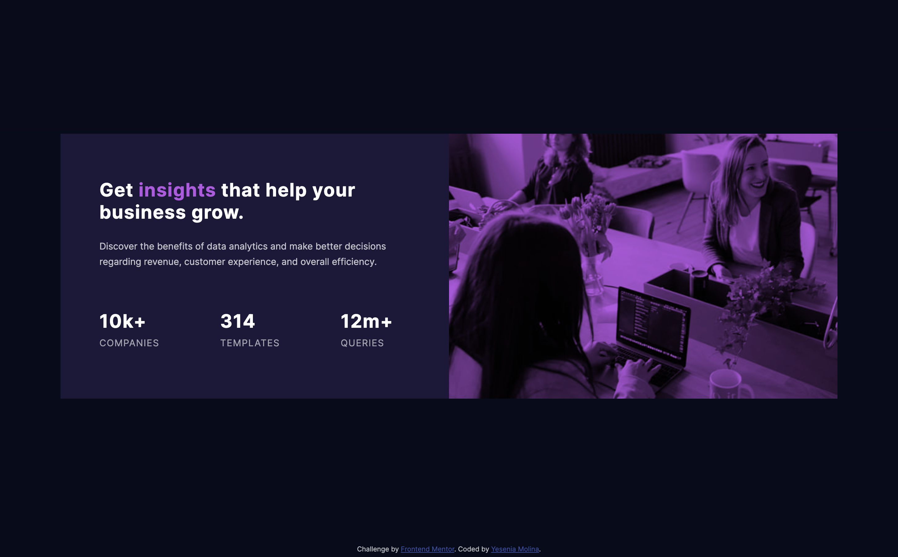
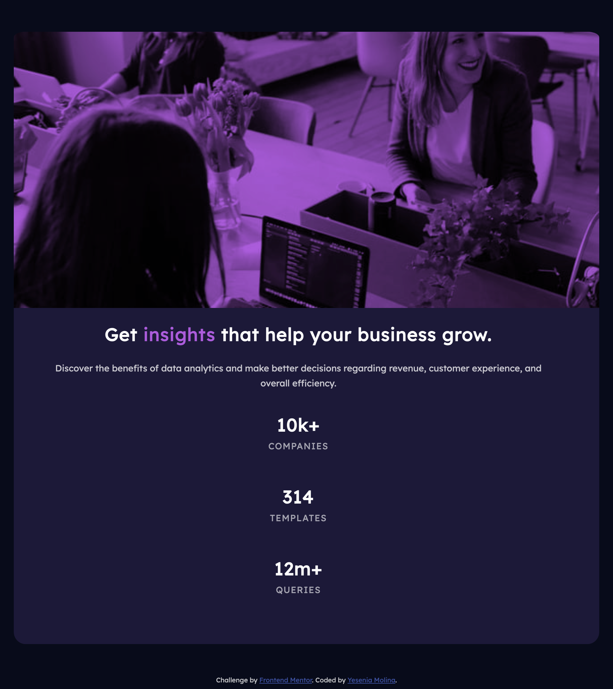

# Frontend Mentor - Stats preview card component solution

This is a solution to the [Stats preview card component challenge on Frontend Mentor](https://www.frontendmentor.io/challenges/stats-preview-card-component-8JqbgoU62). Frontend Mentor challenges help you improve your coding skills by building realistic projects. 

## Table of contents

- [Overview](#overview)
  - [The challenge](#the-challenge)
  - [Screenshot](#screenshot)
  - [Links](#links)
- [My process](#my-process)
  - [Built with](#built-with)
  - [What I learned](#what-i-learned)
- [Author](#author)

## Overview

### The challenge

Users should be able to:

- View the optimal layout depending on their device's screen size

### Screenshot

#### Desktop View


#### Mobile View

##### IPhone X


##### Galaxy S5


##### IPad


##### IPad Landscape


### Links

- Github Pages: [Preview site here](https://yeseniamolinab.github.io/stats-preview-card-component/)

## My process

### Built with

- Semantic HTML5 markup
- CSS
- Flexbox

### What I learned

The major learning I got from this challenge is how to cover an image with a layer of color using just css.

To see how you can add code snippets, see below:

```html
<div class="image" role="img"></div>
```
```css
.image {
    background-blend-mode: multiply;
    background-color: hsl(277, 64%, 61%);
    background-image: url(../images/image-header-desktop.jpg);
    background-position: center;
    background-size: cover;
    object-fit: fill;
    background-repeat: no-repeat;
    width: 50%;
}
```

## Author

- Frontend Mentor - [@yeseniamolinab](https://www.frontendmentor.io/profile/yeseniamolinab)
- Twitter - [@yeseniamolinab](https://www.twitter.com/yeseniamolinab)
